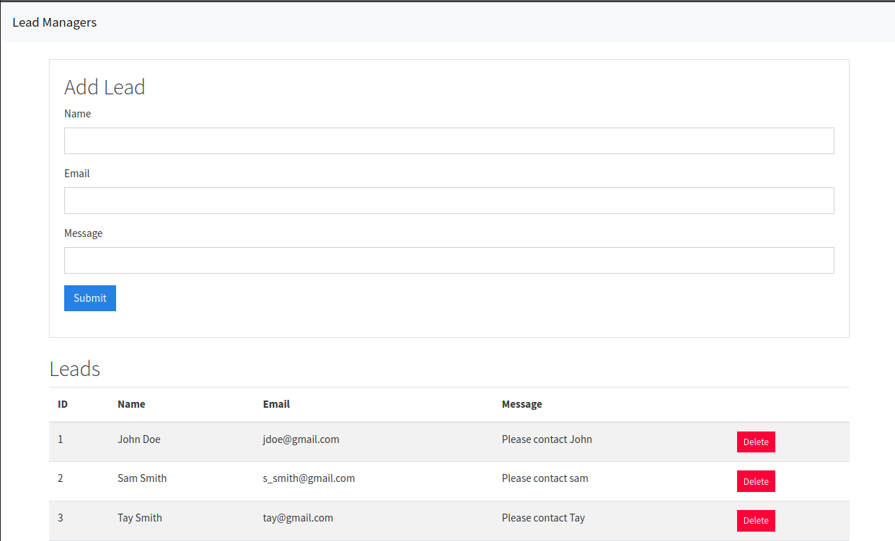

# Lead Generator

## Main Goal: Learn Django-React interface

## Technologies Used:

- Python
- Django
- React
- Webpack
- Babel
- SQL lite

## Project Summary:

This project is designed to generate leads for contacts. There is a Rest API used to pull contacts from the sqlite db. You can add and delete contacts from the single page application.

